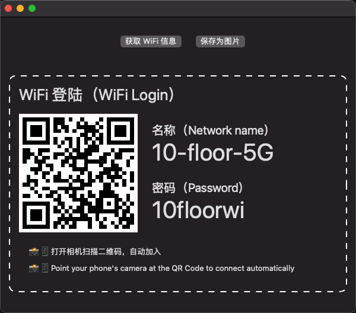
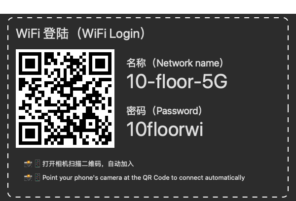

# WiFiPassword

WiFiPassword 是一款 Mac 软件，有如下功能：

1. 忘记 mac 的 wifi 密码之后，可以查看 wifi 密码
2. mac 连接 WiFi 之后，可以生成二维码给手机扫描加入
3. 可以保存 WiFi 信息成图片，UI 还过得去

## 软件信息

1. 开发语言：Swift 5
1. UI：SwiftUI
1. 运行环境：Mac 10.15+

## 运行 UI 截图

| 界面 | 截图 |
| :---: | :---: |
| UI 主界面 |  | 
| 保存的 WiFi 信息图片 |  |


## 其他

下一步可以自定义 WiFi 二维码的颜色，字体颜色，WiFi 信息的背景色。

之前有个 bug，生成的 WiFi 信息的截图的背景是透明的。在调整外观（深色、亮色）之后，因为字体颜色和系统的背景色一致，导致看不到信息了。

some view 在生成截图时，如果不设置背景色，那背景就是透明的。现在设置成了 Window 的默认背景色，并且能随着系统的外观（深色或者浅色）进行变化。

代码如下：
```
.background(Color(NSColor.windowBackgroundColor))
```
## 参考资料

1. 获取 WiFi 密码的思路来源于 [wifi-password](https://github.com/sdushantha/wifi-password)
2. WiFi 信息的 UI 参考了 [wifi-card](https://github.com/bndw/wifi-card)
3. 生成二维码的代码来源于 [QRCode]( https://github.com/aschuch/QRCode)
1. 其他资料 [resize-ciimage-to-an-exact-size](https://stackoverflow.com/questions/61589783/resize-ciimage-to-an-exact-size), [image-resizing](https://nshipster.com/image-resizing/) 等。
 

